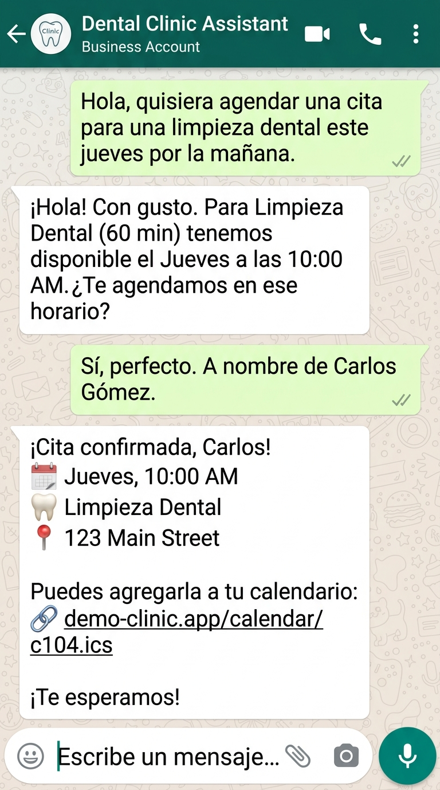
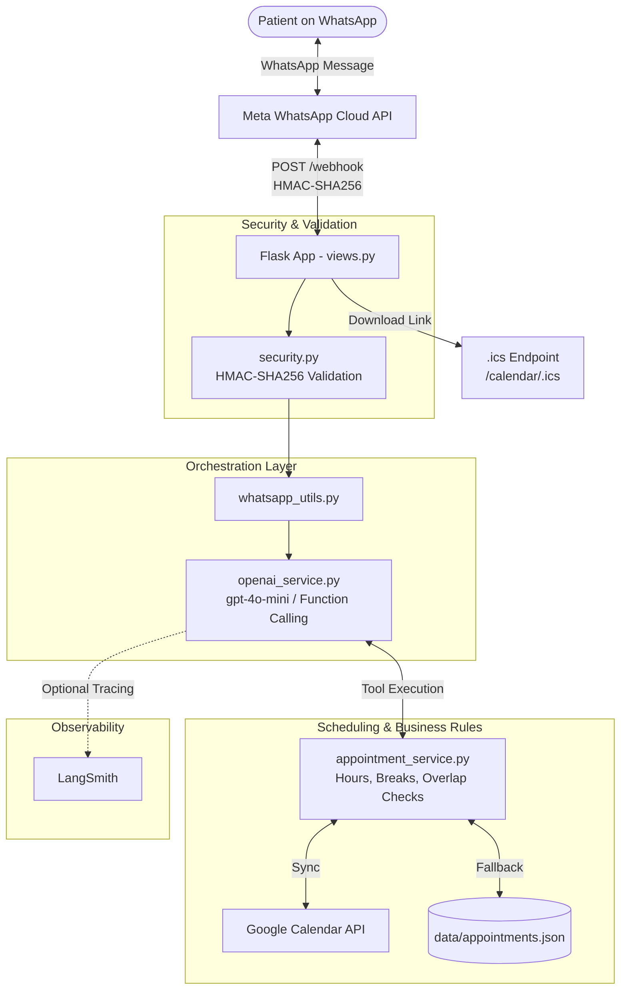

# 🦷 WhatsApp Dental Clinic Assistant (`whatsapp-dental-clinic-bot`)

[](https://www.python.org/downloads/)
[](https://palletsprojects.com/p/flask/)
[](https://openai.com/)
[](https://developers.facebook.com/docs/whatsapp/cloud-api)
[](https://developers.google.com/calendar)
[](https://www.langchain.com/langsmith)
[](tests/)
[](LICENSE)

A conversational assistant for dental clinics built with **Python**, **Flask**, **WhatsApp Cloud API**, and **OpenAI function calling**. It automates patient reception, symptom-based triage, appointment scheduling, rescheduling, and cancellations with real-time calendar synchronization.

<p align="center">
  
</p>

---

## Features

- **Patient inquiry triage**: Maps patient-described symptoms to dental services (e.g., routine prophylaxis vs. urgent endodontic treatment).
- **Dual scheduling backend**:
  - **Google Calendar API**: Synchronizes appointments with the clinic's calendar via a GCP Service Account.
  - **Local persistence (JSON)**: Built-in fallback storage when external calendar integration is not configured.
- **Schedule management**: Enforces operating hours (Monday to Saturday), lunch break windows, service durations, and prevents double-booking.
- **Conflict resolution**: Proactively suggests alternative open slots when a requested time is already taken.
- **iCalendar (.ics) integration**: Generates `.ics` download links directly in chat so patients can add appointments to Apple Calendar, Google Calendar, or Outlook.
- **Webhook security**: Validates payload integrity on incoming webhook requests using HMAC-SHA256 (`X-Hub-Signature-256`) against the Meta app secret.
- **Observability**: Optional tracing with LangSmith to inspect tool executions, latencies, and token usage.
- **Cost optimization**: Evaluates structured booking turns deterministically before falling back to LLM calls to reduce token consumption.

---

## Architecture & Request Flow



### Request Lifecycle
1. **Webhook Ingestion**: Meta sends inbound WhatsApp events to `POST /webhook`.
2. **Signature Verification**: `@signature_required` validates the payload against `APP_SECRET` using HMAC-SHA256.
3. **Conversational Processing**: `whatsapp_utils.py` passes the message body to `openai_service.py`.
4. **Tool Execution**: The model triggers registered tools:
   - `consultar_servicios`
   - `consultar_disponibilidad`
   - `agendar_cita`
   - `consultar_mis_citas`
   - `reagendar_cita`
   - `cancelar_cita`
   - `recomendar_servicio`
5. **Persistence**: `AppointmentManager` validates operating hours, lunch breaks, and conflicts before storing the record in Google Calendar or local JSON.
6. **Dispatch**: Formatted text is sent back to the user via Meta Graph API.

---

## Project Structure

```text
whatsapp-dental-clinic-bot/
├── app/
│   ├── __init__.py                  # Flask application factory
│   ├── config.py                    # Environment variable loader
│   ├── views.py                     # Webhook routes & .ics calendar generation
│   ├── decorators/
│   │   └── security.py              # HMAC-SHA256 signature verification decorator
│   ├── services/
│   │   ├── clinic_profile.py        # Service catalog, working hours, pricing, rules
│   │   ├── appointment_service.py   # Scheduling logic, slot validation & local store
│   │   ├── google_calendar_service.py# Google Calendar API integration
│   │   ├── openai_service.py        # LLM tools, prompt orchestration & message handler
│   │   └── observability.py         # LangSmith tracing wrappers
│   └── utils/
│       └── whatsapp_utils.py        # Meta Graph API sender & text formatting
├── data/
│   └── appointments.json            # Local fallback storage
├── docs/
│   └── demo.jpg                     # Demo screenshot
├── tests/
│   └── test_appointment_service.py # Unit tests for scheduling and validation rules
├── run.py                           # Application entrypoint & startup diagnostics
├── requirements.txt                 # Pinned Python dependencies
├── example.env                      # Documented environment variables template
├── google-calendar-service-account.example.json # Service account template
├── LICENSE                          # MIT License
└── README.md                        # Documentation
```

---

## Services Catalog

The default catalog is defined in [`app/services/clinic_profile.py`](app/services/clinic_profile.py):

| Service Key | Service Name | Duration | Price (USD) | Category |
| :--- | :--- | :---: | :---: | :--- |
| `consulta_valoracion` | Dental Evaluation & Diagnostics | 45 min | $25.00 | Diagnostic |
| `limpieza_rutina` | Routine Cleaning (Prophylaxis) | 60 min | $35.00 | Preventive |
| `limpieza_profunda` | Deep Cleaning (Scaling / Root Planing) | 90 min | $80.00 | Periodontics |
| `resina_dental` | Composite Dental Filling | 60 min | $45.00 | Restorative |
| `extraccion_simple` | Simple Tooth Extraction | 40 min | $60.00 | Surgery |
| `endodoncia` | Root Canal Therapy | 90 min | $140.00 | Endodontics |
| `corona_dental` | Dental Crown | 60 min | $180.00 | Prosthetics |
| `blanqueamiento` | In-Office Teeth Whitening | 90 min | $120.00 | Cosmetic |
| `urgencia_dental` | Emergency Toothache Treatment | 30 min | $30.00 | Emergency |
| `control_post_tratamiento`| Post-Treatment Follow-up | 30 min | $20.00 | Follow-up |

### Clinic Hours
- **Monday to Friday**: 08:00 – 17:00 (Lunch break: 12:30 – 13:30)
- **Saturday**: 08:00 – 13:00 (No lunch break)
- **Sunday**: Closed

---

## Getting Started

### 1. Prerequisites
- **Python 3.10+**
- A **Meta for Developers** account with a WhatsApp Business Cloud app.
- An **OpenAI API key** (or OpenRouter).
- *(Optional)* A **Google Cloud Platform** project with Calendar API enabled and a Service Account key.

### 2. Installation

```bash
git clone https://github.com/kewingJ/whatsapp-dental-clinic-bot.git
cd whatsapp-dental-clinic-bot

python3 -m venv venv
source venv/bin/activate    # On Windows: venv\Scripts\activate
pip install -r requirements.txt
```

### 3. Environment Configuration

Copy the example file:

```bash
cp example.env .env
```

Configure the environment variables in `.env`:

```ini
# Meta WhatsApp Cloud API
ACCESS_TOKEN="EAAxxxxxxx..."
APP_ID="123456789012345"
APP_SECRET="abcdef0123456789abcdef0123456789"
VERSION="v22.0"
PHONE_NUMBER_ID="123456789012345"
VERIFY_TOKEN="your_webhook_verification_token"

# OpenAI / LLM
OPENAI_API_KEY="sk-proj-xxxxxxx..."
OPENAI_MODEL="gpt-4o-mini"

# Public URL (for .ics calendar downloads)
PUBLIC_URL="https://your-domain.ngrok-free.app"

# Optional: Google Calendar Integration
GOOGLE_SERVICE_ACCOUNT_FILE="secrets/google-calendar-service-account.json"
GOOGLE_CALENDAR_ID="your_calendar_id@group.calendar.google.com"

# Optional: LangSmith Tracing
LANGSMITH_TRACING="false"
LANGSMITH_API_KEY="lsv2_pt_xxxxxxx..."
LANGSMITH_PROJECT="Dental Clinic Bot"
```

### 4. Optional: Google Calendar Setup
1. In Google Cloud Console, enable the **Google Calendar API**.
2. Create a **Service Account** and generate a JSON Key.
3. Save the JSON file in `secrets/google-calendar-service-account.json` (excluded by `.gitignore`).
4. In Google Calendar, go to **Settings > Share with specific people** and add the service account email with **"Make changes to events"** permissions.
5. Set `GOOGLE_CALENDAR_ID` in `.env`.

### 5. Running the Application

```bash
python run.py
```
The server runs on `http://0.0.0.0:8000`.

### 6. Webhook Setup for Local Testing
Use [ngrok](https://ngrok.com/) to expose port 8000:

```bash
ngrok http 8000
```

In **Meta App Dashboard > WhatsApp > Configuration**:
- **Callback URL**: `https://<your-ngrok-subdomain>.ngrok-free.app/webhook`
- **Verify Token**: Must match `VERIFY_TOKEN` in your `.env`.
- **Webhook Fields**: Subscribe to `messages`.

---

## Unit Tests

The test suite covers appointment validation, working hour limits, lunch break windows, and conflict handling:

```bash
python -m unittest discover tests -v
```

### Tested Scenarios
- `test_check_availability_valid_slot`: Slot inside working hours returns available.
- `test_outside_hours_early_and_late`: Rejects slots before opening (08:00) or after closing (17:00).
- `test_outside_hours_sunday`: Rejects Sunday bookings.
- `test_lunch_break_window_conflict`: Rejects slots overlapping the 12:30–13:30 lunch break.
- `test_create_appointment_success`: Validates booking creation and persistence.
- `test_detect_overlapping_appointment_conflict`: Rejects bookings that collide with existing appointments.
- `test_reschedule_appointment`: Updates appointment time and frees the previous slot.
- `test_cancel_appointment_releases_slot`: Marks appointment cancelled and makes the slot available again.
- `test_suggest_available_slots`: Validates slot suggestions avoiding lunch breaks and closed hours.

---

## Conversational Test Scenarios

| Scenario | Patient Message | Expected Bot Behavior |
| :--- | :--- | :--- |
| **New Booking** | *"Hola, quiero agendar una limpieza para el próximo jueves a las 10am"* | Checks slot availability, confirms patient name, books the slot, and returns a confirmation with `.ics` link. |
| **Conflict Handling** | *"¿Tienen espacio mañana a las 12:30 para una valoración?"* | Flags lunch break conflict and suggests closest available open slots. |
| **Triage / Guidance** | *"Tengo dolor punzante en una muela desde anoche, ¿qué servicio debo elegir?"* | Recommends `urgencia_dental` or `consulta_valoracion` and checks same-day slots. |
| **Rescheduling** | *"Quisiera cambiar mi cita del jueves para el viernes a las 3pm"* | Finds the active booking by phone number, checks new slot, and updates the calendar. |
| **Cancellation** | *"Por motivos de viaje necesito cancelar mi cita"* | Confirms booking details, marks status as cancelled, and frees the calendar slot. |

---

## Observability with LangSmith

When `LANGSMITH_TRACING=true` is enabled:
- Inspect message turns and tool executions.
- Monitor response latency and token usage per call.
- Identify malformed tool parameters or API errors.

---

## Security & Data Privacy

- **No hardcoded credentials**: Tokens, secrets, and private keys are read from environment variables and excluded by `.gitignore`.
- **Webhook verification**: All incoming POST payloads are verified using SHA-256 HMAC signatures against Meta's app secret.
- **Anonymized data**: Clinic profiles, addresses, and sample files use neutral demo values.

---

## Author

**Kewing Joel Jarquin Cerda**
- GitHub: [@kewingJ](https://github.com/kewingJ)
- Email: [kewingjarquin@gmail.com](mailto:kewingjarquin@gmail.com)

---

## License

This project is licensed under the MIT License - see the [LICENSE](LICENSE) file for details.

Originally based on Datalumina's `python-whatsapp-bot` template (webhook handling and message sending). The appointment logic, AI function calling, Google Calendar integration, LangSmith observability and unit tests were developed by Kewing Joel Jarquin Cerda.
