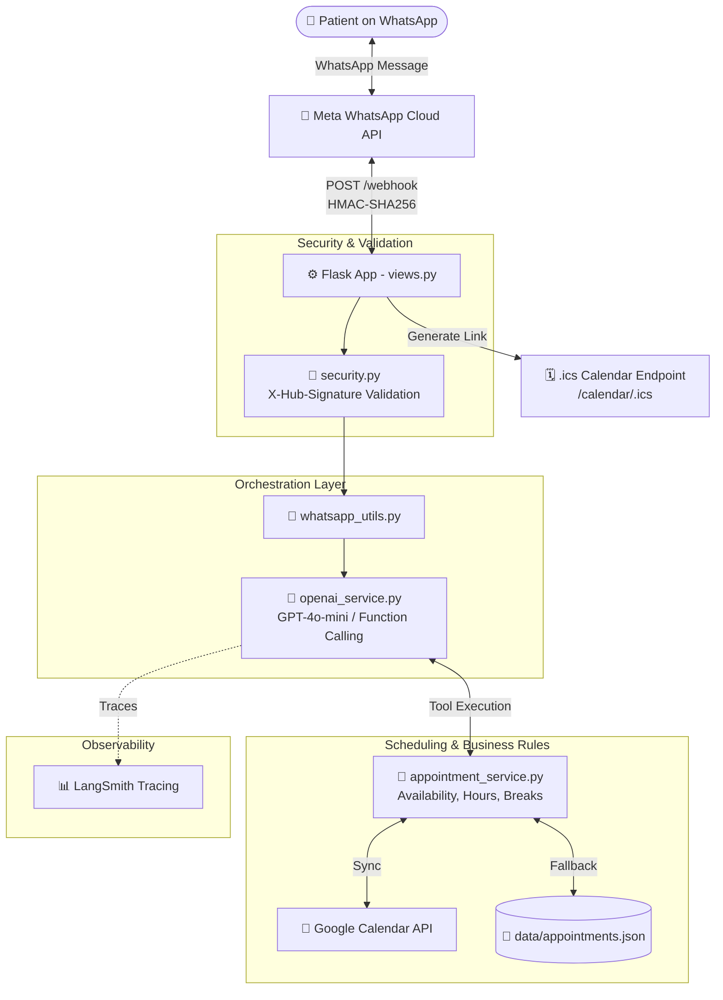

# 🦷 WhatsApp AI Dental Clinic Assistant (`whatsapp-dental-clinic-bot`)

[](https://www.python.org/downloads/)
[](https://palletsprojects.com/p/flask/)
[](https://openai.com/)
[](https://developers.facebook.com/docs/whatsapp/cloud-api)
[](https://developers.google.com/calendar)
[](https://www.langchain.com/langsmith)
[](LICENSE)

A production-grade, conversational AI assistant designed for dental clinics and healthcare practices. Built with **Python**, **Flask**, **WhatsApp Cloud API**, and **OpenAI Function Calling**, this bot automates patient reception, intelligent triage, appointment scheduling, rescheduling, and cancellations with real-time calendar synchronization.

---

## 🌟 Key Highlights

- **Intelligent Patient Triage**: Understands patient symptoms in natural language and recommends the most appropriate dental service (e.g., distinguishing between routine cleanings and emergency endodontics).
- **Dual Scheduling Backend**:
  - **Google Calendar API**: Synchronizes appointments directly with the clinic's Google Calendar via a GCP Service Account.
  - **Local Persistence (JSON)**: Built-in zero-dependency fallback storage when cloud calendar services are offline or unconfigured.
- **Strict Business Logic & Slot Management**: Enforces operating hours (Mon–Sat), lunch break windows, appointment durations, and prevents double-booking.
- **Smart Conflict Resolution**: When a requested slot is occupied, the assistant proactively suggests the closest available slots.
- **Interactive Calendar Invites (`.ics`)**: Generates dynamic iCalendar (`.ics`) download links directly in WhatsApp so patients can add their appointment to Apple Calendar, Outlook, or Google Calendar with a single tap.
- **Enterprise Security**: Webhook integrity verification using HMAC-SHA256 signatures (`X-Hub-Signature-256`) against Meta's app secret.
- **Full Observability & Tracing**: Native, toggleable integration with **LangSmith** to inspect conversation traces, tool execution latency, and token consumption.
- **Hybrid Cost-Effective Architecture**: Uses deterministic state machines and prompt engineering to minimize redundant LLM tool-calling and token costs.

---

## 📐 Architecture & Workflow



### Request Lifecycle:
1. **Webhook Ingestion**: Meta sends inbound WhatsApp events via `POST /webhook`.
2. **Signature Verification**: `@signature_required` validates the payload against `APP_SECRET` using SHA-256 HMAC.
3. **Conversational Processing**: `whatsapp_utils.py` forwards the message to `openai_service.py`.
4. **Tool Execution (Function Calling)**: The LLM interacts with registered tools:
   - `consultar_servicios`
   - `consultar_disponibilidad`
   - `agendar_cita`
   - `consultar_mis_citas`
   - `reagendar_cita`
   - `cancelar_cita`
   - `recomendar_servicio`
5. **Calendar Sync**: `AppointmentManager` executes business logic (validating working hours, lunch pauses, and overlaps), then persists the appointment in Google Calendar or local JSON.
6. **Dispatch**: The assistant formats the response (converting markdown to WhatsApp formatting) and sends it back to the patient via Meta Graph API.

---

## 📂 Project Structure

```text
whatsapp-dental-clinic-bot/
├── app/
│   ├── __init__.py                  # Flask Application Factory pattern
│   ├── config.py                    # Environment configuration loader
│   ├── views.py                     # Webhook routes (GET verify, POST message) & .ics generation
│   ├── decorators/
│   │   └── security.py              # HMAC-SHA256 signature verification decorator
│   ├── services/
│   │   ├── clinic_profile.py        # Catalog of services, working hours, pricing & rules
│   │   ├── appointment_service.py   # Scheduling logic, slot validation & local JSON backend
│   │   ├── google_calendar_service.py# Google Calendar API integration via Service Account
│   │   ├── openai_service.py        # LLM tools, system prompt, context & message handler
│   │   └── observability.py         # LangSmith tracing wrappers and telemetry
│   └── utils/
│       └── whatsapp_utils.py        # Meta Graph API sender & text formatting utilities
├── data/
│   └── appointments.json            # Local fallback appointment store
├── run.py                           # Application entrypoint & runtime diagnostics
├── requirements.txt                 # Pinned Python dependencies
├── example.env                      # Documented environment variables template
├── google-calendar-service-account.example.json # Template for GCP credentials
├── LICENSE                          # MIT License
└── README.md                        # Documentation
```

---

## 🦷 Default Services Catalog

The clinic's catalog is fully customizable in [`app/services/clinic_profile.py`](app/services/clinic_profile.py):

| Service Key | Service Name | Estimated Duration | Reference Price (USD) | Category |
| :--- | :--- | :---: | :---: | :--- |
| `consulta_valoracion` | Dental Evaluation & Diagnostics | 45 min | $25.00 | Diagnostic |
| `limpieza_rutina` | Routine Cleaning (Prophylaxis) | 60 min | $35.00 | Preventive |
| `limpieza_profunda` | Deep Cleaning (Scaling / Root Planing) | 90 min | $80.00 | Periodontics |
| `resina_dental` | Composite Dental Filling | 60 min | $45.00 | Restorative |
| `extraccion_simple` | Simple Tooth Extraction | 40 min | $60.00 | Surgery |
| `endodoncia` | Root Canal Therapy | 90 min | $140.00 | Endodontics |
| `corona_dental` | Dental Crown | 60 min | $180.00 | Prosthetics |
| `blanqueamiento` | In-Office Teeth Whitening | 90 min | $120.00 | Cosmetic |
| `urgencia_dental` | Emergency Toothache Treatment | 30 min | $30.00 | Emergency |
| `control_post_tratamiento`| Post-Treatment Follow-up | 30 min | $20.00 | Follow-up |

### Working Hours & Policies
- **Monday to Friday**: 08:00 – 17:00 (Lunch break: 12:30 – 13:30)
- **Saturday**: 08:00 – 13:00 (No lunch break)
- **Sunday**: Closed
- **Promotions**: Configurable first-visit discount (e.g., 20% off during promotional months).

---

## 🚀 Getting Started

### 1. Prerequisites
- **Python 3.10+**
- A **Meta for Developers** account with a WhatsApp Business Cloud app configured.
- An **OpenAI API key** (or OpenRouter API key).
- *(Optional)* A **Google Cloud Platform** project with Google Calendar API enabled and a Service Account JSON key.

### 2. Installation

Clone this repository and create a virtual environment:

```bash
git clone https://github.com/kewingJ/whatsapp-dental-clinic-bot.git
cd whatsapp-dental-clinic-bot

python3 -m venv venv
source venv/bin/activate    # On Windows: venv\Scripts\activate
pip install -r requirements.txt
```

### 3. Environment Configuration

Copy the example environment file:

```bash
cp example.env .env
```

Edit `.env` with your credentials:

```ini
# Meta WhatsApp Cloud API
ACCESS_TOKEN="EAAxxxxxxx..."
APP_ID="123456789012345"
APP_SECRET="abcdef0123456789abcdef0123456789"
VERSION="v22.0"
PHONE_NUMBER_ID="123456789012345"
VERIFY_TOKEN="your_custom_secure_verify_token"

# OpenAI / LLM
OPENAI_API_KEY="sk-proj-xxxxxxx..."
OPENAI_MODEL="gpt-4.1-mini"

# Public URL (for .ics calendar file downloads)
PUBLIC_URL="https://your-domain.ngrok-free.app"

# Optional: Google Calendar Integration
GOOGLE_SERVICE_ACCOUNT_FILE="secrets/google-calendar-service-account.json"
GOOGLE_CALENDAR_ID="your_calendar_id@group.calendar.google.com"

# Optional: LangSmith Observability
LANGSMITH_TRACING="false"
LANGSMITH_API_KEY="lsv2_pt_xxxxxxx..."
LANGSMITH_PROJECT="Dental Clinic Bot"
```

### 4. Optional: Google Calendar Setup
1. In Google Cloud Console, enable the **Google Calendar API**.
2. Create a **Service Account** and generate a JSON Key.
3. Save the JSON key inside `secrets/google-calendar-service-account.json` (this directory is ignored by Git).
4. Open the Google Calendar you want the bot to manage, go to **Settings > Share with specific people**, and add your Service Account's email address with **"Make changes to events"** permissions.
5. Copy your **Calendar ID** into `GOOGLE_CALENDAR_ID` in `.env`.

### 5. Running the Application

Run the server locally:

```bash
python run.py
```
By default, the server starts on `http://0.0.0.0:8000`.

### 6. Webhook Exposure (Local Testing)
Use [ngrok](https://ngrok.com/) to expose your local port 8000:

```bash
ngrok http 8000
```

In your **Meta App Dashboard > WhatsApp > Configuration**:
- **Callback URL**: `https://<your-ngrok-subdomain>.ngrok-free.app/webhook`
- **Verify Token**: Must match the `VERIFY_TOKEN` defined in your `.env`.
- **Webhook Fields**: Subscribe to `messages`.

---

## 🧪 Real-World Test Scenarios

The bot handles complex conversational flows gracefully:

| Scenario | Patient Message | Bot Behavior |
| :--- | :--- | :--- |
| **New Booking** | *"Hola, quiero agendar una limpieza para el próximo jueves a las 10am"* | Checks availability for that 60-min window, confirms patient name, schedules appointment, and sends confirmation with an `.ics` link. |
| **Conflict Handling** | *"¿Tienen espacio mañana a las 12:30 para una valoración?"* | Detects lunch pause / occupied slot, informs the patient, and suggests available slots (e.g., 10:30am or 2:00pm). |
| **Triage / Guidance** | *"Tengo dolor punzante en una muela desde anoche, ¿qué servicio debo elegir?"* | Recommends `urgencia_dental` or `consulta_valoracion` and offers urgent slots for that day. |
| **Rescheduling** | *"Quisiera cambiar mi cita del jueves para el viernes a las 3pm"* | Locates existing active booking by patient phone number, checks new slot, and updates date/time in the calendar. |
| **Cancellation** | *"Por motivos de viaje necesito cancelar mi cita"* | Confirms booking details and marks status as cancelled, releasing the calendar slot immediately. |

---

## 📊 Telemetry & Observability with LangSmith

This project features native tracing for production monitoring. When `LANGSMITH_TRACING=true` is enabled:
- **Trace Visualization**: View each conversational turn as an execution tree showing system prompts, tool inputs/outputs, and final generations.
- **Latency & Token Tracking**: Monitor model response latency and exact token usage per tool invocation.
- **Error Auditing**: Instantly identify failed API calls or malformed parameter payloads.

---

## 🔒 Security Best Practices

- **Zero Hardcoded Credentials**: All tokens, keys, and private certificates are loaded via environment variables and strictly ignored by Git.
- **Cryptographic Signature Verification**: Every incoming webhook request is validated against Meta's SHA-256 HMAC header before any business logic is executed.
- **Generic Anonymized Data**: Default clinic profiles and calendar files use generic demo placeholders suitable for open-source publication.

---

## 👨‍💻 Author

**Kewing Jarquín**
- GitHub: [@kewingJ](https://github.com/kewingJ)
- Email: [kewingjarquin@gmail.com](mailto:kewingjarquin@gmail.com)

---

## 📄 License

This project is licensed under the MIT License - see the [LICENSE](LICENSE) file for details.
